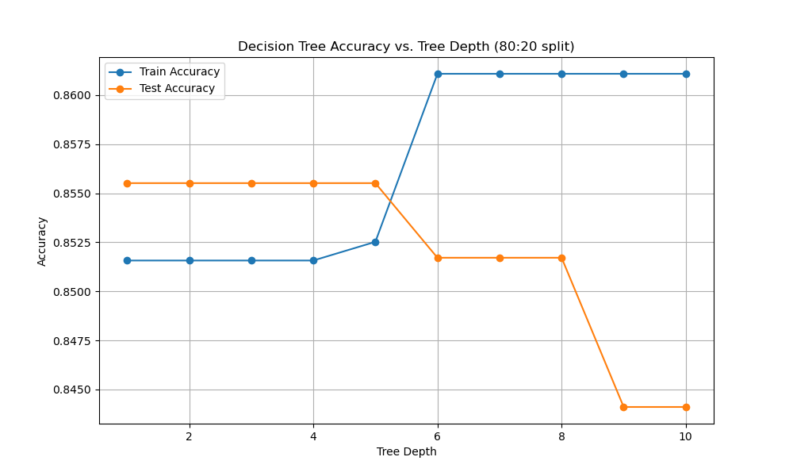
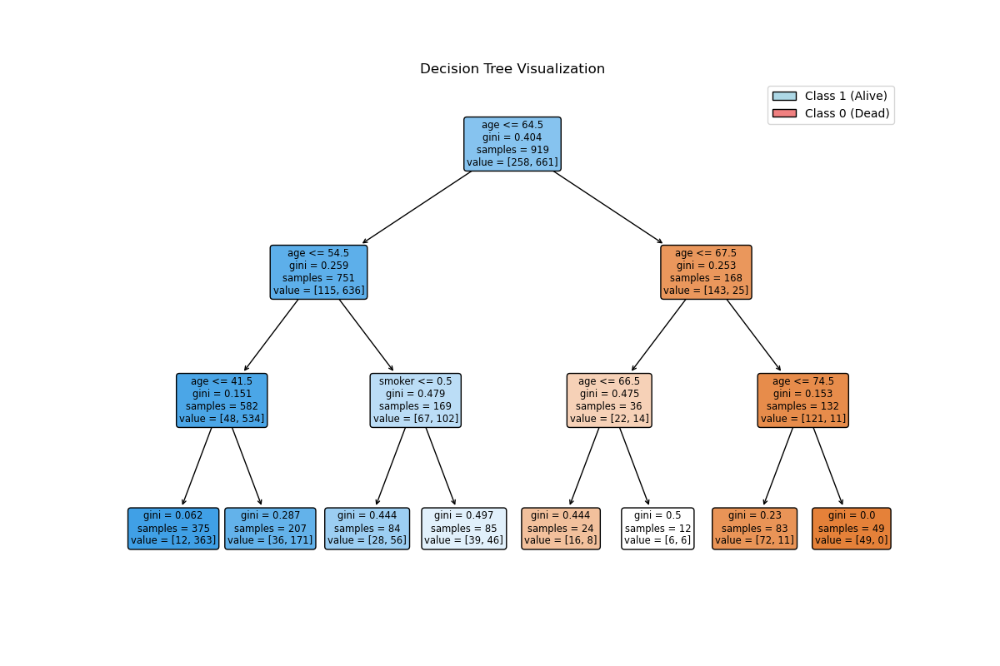

# Module_14_Decision_Trees
Using Decision Trees, machine learning models, for both classification and regression tasks

***TOPIC: OVERFITTNG IN DECISION TREES***

Decision trees are popular machine learning models used for both classification and regression tasks. They resemble human decision-making processes and are easy to visualize. Each node represents a decision based on a feature, making the model straightforward to interpret.

In this study we used the Whickham dataset to classify individuals as alive or dead based on their smoking status and age. 

***Why Decision trees?***
* Decision trees capture non-linear relationships between features and target variables, unlike linear models that assume a linear relationship.
* They provide insights into which features are most important for predicting the target variable. During the training process, decision trees automatically select the most important features and ignore the less relevant ones.
* Unlike many other algorithms, decision trees don’t require normalization or standardization of features, as they are not sensitive to the scale of the features.
* Can handle both numerical and categorical data and can be adapted to various types of problems by tuning parameters such as the depth of the tree or the minimum number of samples required to split a node.
* Decision trees can handle missing values by learning the best way to split the data at each node.

***Limitations***
* ***Overfitting:*** Decision trees can easily overfit the training data, especially if they grow too deep. Techniques like pruning, setting a maximum depth, or requiring a minimum number of samples per leaf can help mitigate this. Using Grid Search to tune hyperparameters allows us to find a balance between underfitting and overfitting by selecting the best max_depth, min_samples_leaf, and min_samples_split that helps in creating a model that generalizes well to new, unseen data.
* ***Instability:*** Small changes in the data can result in a completely different tree structure. Ensemble methods like Random Forests or Gradient Boosting can help address this issue by combining multiple trees.

***Consequences of Overfitting:*** 
* ***Model Complexity:*** An overfitted model is too complex and captures noise in the training data, leading to poor generalization.

***Model Selection:*** To avoid overfitting, it's crucial to select a model that balances complexity and performance, often by using cross-validation to find an optimal max_depth.

In this study, we determined when a decision tree begins to overfit. 
***Data Preparation:*** Categorical variables (smoker, outcome) were converted into numerical variables and data split into varying training and test sets. 
***Model Training and Evaluation:*** Decision tree models with varying max_depth values from 1 to 10 were trained, computing the accuracy on both the training and test sets  
***Plotting:*** The results were plotted to visualize how accuracy changes with different max_depth values inorder to identify the point where the model starts to overfit.

***Interpretation:***   
* ***Training Accuracy:*** Increases with tree depth. A deeper tree can fit the training data more precisely. 
* ***Test Accuracy:*** Increases up to a certain depth, after which it may start to decrease. This drop indicates overfitting, where the model performs well on training data but poorly on unseen test data.

***Finding the best hyperparameters using Grid Search*** 
* 'max_depth':  None means the tree will expand until all leaves are pure
* 'min_samples_leaf': Minimum number of samples required to be at a leaf node
* 'min_samples_split': Minimum number of samples required to split an internal node

***Results*** 
* ***Best Parameters:*** The combination of max_depth, min_samples_leaf, and min_samples_split that yields the highest accuracy on cross-validation is: 
  {'max_depth': 3, 'min_samples_leaf': 1, 'min_samples_split': 2}
* ***Training Accuracy:*** The best score from cross-validation, showing how well the model performs on the training data with the selected hyperparameters is 0.85.
* ***Test Accuracy:***  The model's performance on unseen data, indicating how well it generalizes is 0.86.

***Fitting a Decision Tree Classifier with specific hyperparameters; max_depth=3, min_samples_leaf=1, and min_samples_split=2***

***Summary***  
***For ages ≤ 64.50:***
* If age ≤ 54.50, then if age ≤ 41.50, the prediction is class 1 (Alive); if age > 41.50 but ≤ 54.50, the prediction is still class 1 (Alive).
* If age > 54.50, the prediction is class 1 (Alive) regardless of smoking status.

***For ages > 64.50:***
* If age ≤ 67.50, the prediction is class 0 (Dead), regardless of whether age is ≤ 66.50 or > 66.50.
* If age > 67.50, the prediction is class 0 (Dead) regardless of whether age is ≤ 74.50 or > 74.50.
